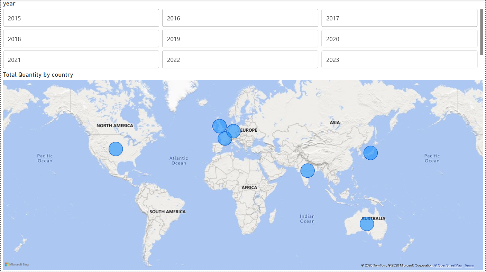

🚗 Tata Cars Sales Dashboard — Power BI

An interactive Tata Cars Sales Dashboard built using Microsoft Power BI to analyze sales performance, revenue, vehicle characteristics, geographic distribution, and customer behavior.

📊 Project Overview

This Power BI project provides an interactive view of Tata Cars sales data through multiple dashboard pages. It helps analyze:

- Total sales quantity and revenue
- Average selling price
- Top-performing car models
- Sales trends over time
- Regional and country-wise performance
- Fuel type and transmission preferences
- Customer demographics and behavior
- New vs. repeat customers

🛠️ Tools & Technologies

- Microsoft Power BI
- Power Query
- DAX
- Data Modeling
- Interactive Data Visualization

📑 Dashboard Pages

1. Executive Overview

Provides a high-level summary of the Tata Cars sales performance.

Key KPIs:

- Total Quantity
- Total Revenue
- Average Selling Price
- Top Model
- Top Country by Sales
- First/Top Color

Visualizations include:

- Revenue by year
- Revenue by region
- Units sold by year
- Top 5 models by revenue
- Top 5 models by units sold
- Units sold by fuel type
- Units sold by transmission
- Country-wise sales summary

2. Map

The Map page provides a geographic view of Tata Cars performance.

It includes:

- Country-wise total units sold
- Year-based filtering
- Geographic comparison of sales performance

3. Customer View

The Customer View focuses on customer-related insights.

Key KPIs:

- Total Customers
- New Customers
- Repeat Customers
- Average Revenue

Analysis includes:

- Customers by country
- Customer age groups
- Revenue by customer age group
- Country and year filters
- Geographic customer distribution

📈 Key Analysis Areas

Sales Performance

Analyze total quantity, revenue, average selling price, and yearly sales trends.

Product Performance

Identify the top car models based on revenue and units sold.

Vehicle Preferences

Compare sales based on:

- Fuel Type
- Transmission
- Car Model
- Color

Geographic Analysis

Understand sales and customer distribution across different countries and regions.

Customer Analysis

Analyze customer volume, new vs. repeat customers, age groups, and revenue contribution.

🎯 Project Objective

The main objective of this dashboard is to transform Tata Cars sales data into meaningful and interactive business insights that can support:

- Sales performance monitoring
- Product performance analysis
- Customer segmentation
- Geographic analysis
- Business decision-making

📂 Project File

The main Power BI project file is:

"Tata cars Dashboard.pbix"

Open the ".pbix" file using Microsoft Power BI Desktop to explore the interactive dashboard.

🚀 How to Use

1. Download the "Tata cars Dashboard.pbix" file from this repository.
2. Open it using Microsoft Power BI Desktop.
3. Navigate through the dashboard pages.
4. Use the available filters and slicers to explore the data.
5. Interact with the visualizations to analyze different business dimensions.

🖼️ Dashboard Preview

📊 Executive View  

🗺️ Map  

👥 Customer View  

👨‍💻 Author

Soham Tanavade

This project was created as part of a Data Analytics / Power BI portfolio project.

---

⭐ If you found this project useful, feel free to explore the dashboard and repository.

